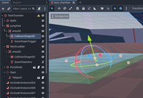
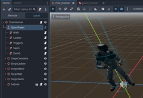

# gsom_pawns

Modular character pawns that interact with environment and triggers through handler nodes.

The aim of this addon is to provide a framework for characters with various
movement styles. This addon does NOT handle user input, but it provides an easy
way to relay your (or AI) input to pawns.

The concept of a Pawn is derived from **Unreal Engine**
[where](https://dev.epicgames.com/documentation/en-us/unreal-engine/pawn-in-unreal-engine):

> A Pawn is the physical representation of a player or AI entity within the world. [...]
	represents the physical location, rotation, etc. of a player or entity within the game.

Here the idea is the same, although the implementation is very different - somewhat Godot-way.

[](gdignore/screenshot_1.jpg)
[](gdignore/screenshot_2.jpg)

The demo is further explained [below the classes](#demo).

## GsomPawn

This node is the key part of the framework. It expects
to be a child of `Node3D` - your character, that you are going to script later.
For such `GsomPawn` node, you have to choose a `scene` that represents its physical body.
Any descendant of `Node3D` is fine, and can **optionally** have `linear_velocity` and
`angular_velocity` properties (as physics nodes would).

Example structure:

```gdscript
MainScene
|---Controller # not a child of pawn or character
|   |---Camera # <-- the actual camera is inside controller
|   |---Hud
|   |---EscMenu
|
|---Character # <-- this is yours, attach a script here
	|---GsomPawn # <-- this is the GsomPawn node
	|   |   [GsomPawn.scene] # <-- your scene defines the body
	|   |---PawnHandler1
	|   |---PawnHandler2
	|   |---PawnHandler3 # <-- these extend GsomPawnHandler
	|   
	|---Mesh # anything else that you need for a character
	|---AudioStep
```

Your concerns:
- What the character looks and sound like.
- What the character body can physically do (e.g. change shape, use physics, etc.).
- How you attach controllers and how they interact with the characters.
- How exactly the character moves in different contexts.

Framework concerns:
- Instantiate the body scene and track it during runtime and in Editor.
- Interpolate the perceived head/camera position during shape changes.
- Run the attached pawn handlers according to pawn state and filters.
- Store pawn info fields and facilitate interactions with triggers and envs.


**Signals**

`signal moved(pos: Vector3)`
	- The pawn has finished the `_physics_process` logic. This is the right time
	to use the position to update cameras or other stuff.

`signal accelerated_linear(dv: Vector3)`
	- The body changed its linear speed - only emits if `track_accel_linear`.

`signal accelerated_angular(dv: Vector3)`
	- The body changed its angular speed - only emits if `track_accel_angular`.

`signal moved_head(head_y: float)`
	- The relative position of the head changed.

`signal triggered(trigger_name: String, value: Variant)`
	- The body has produced an event with optional data.


**Properties**

`readonly Vector3 angular_velocity`
	- Angular velocity vector, only updated if has_velocity_angular.

`readonly Node3D body`
	- Get the cached physical body object as instantiated from scene.

`bool has_velocity_angular [default: false]`
	- If the pawn needs to track its angular velocity.

`bool has_velocity_linear [default: false]`
	- If the pawn needs to track its linear velocity.

`bool track_accel_angular [default: false]`
	- If the pawn needs to track its angular acceleration.

`bool track_accel_linear [default: false]`
	- If the pawn needs to track its linear acceleration.

`readonly Vector3 linear_velocity`
	- Linear velocity vector, only updated if has_velocity_linear.

`readonly Vector3 position`
	- Get position of the body.

`float head_speed [default: 1.0]`
	- How quickly the "head" moves towards the target position (m/s).

`readonly float head_y`
	- Get the animated head/eye/camera position Y.
	This value is animated towards head_y_target with the speed of head_speed (meters per second).

`float head_y_target [default: 0.0]`
	- Set this value to define the intended head height of the body.
	When this value is set from _ready, it will be applied immediately without animation.

`PackedScene scene`
	- Scene that will be instantiated for this pawn

**Methods**

`void do_integrate(state: PhysicsDirectBodyState3D)`
	- Framework method, should be called by scene instance on `_integrate_forces`.

`void do_physics(dt: float)`
	- Framework method, should be called by scene instance on `_physics_process`.

`void do_process(dt: float)`
	- Framework method, should be called by scene instance on `_process`.

`bool erase_action(field_name: String)`
	- Shortcut for `erase_info("actions", field_name)`.

`bool erase_env(field_name: String)`
	- Shortcut for `erase_info("envs", field_name)`.

`bool erase_info(group_name: String, field_name: String)`
	- Erase the input value.

`bool erase_state(field_name: String)`
	- Shortcut for `erase_info("states", field_name)`.

`bool erase_trait(field_name: String)`
	- Shortcut for `erase_info("traits", field_name)`.

`Variant get_action(field_name: String, default_value: Variant = null)`
	- Shortcut for `get_info("actions", field_name, default_value)`.

`Variant get_env(field_name: String, default_value: Variant = null)`
	- Shortcut for `get_info("envs", field_name, default_value)`.

`Variant get_info(group_name: String, field_name: String, default_value: Variant = null)`
	- Fetch an info field by group name and field name. 
	If the field has never been set or reset_info has just been called,
	this method returns default_value.

`Variant get_state(field_name: String, default_value: Variant = null)`
	- Shortcut for `get_info("states", field_name, default_value)`.

`Variant get_trait(field_name: String, default_value: Variant = null)`
	- Shortcut for `get_info("traits", field_name, default_value)`.

`bool has_action(field_name: String)`
	- Shortcut for `has_info("actions", field_name)`.

`bool has_env(field_name: String)`
	- Shortcut for `has_info("envs", field_name)`.

`bool has_info(group_name: String, field_name: String)`
	- Check if the input info exists.

`bool has_state(field_name: String)`
	- Shortcut for `has_info("states", field_name)`.

`bool has_trait(field_name: String)`
	- Shortcut for `has_info("traits", field_name)`.

`void reset_actions()`
	- Shortcut for `reset_info("actions")`.

`void reset_envs()`
	- Shortcut for `reset_info("envs")`.

`void reset_info(group_name: String = "")`
	- Clear an info group by name, or wipe all groups if name is empty.

`void reset_states()`
	- Shortcut for `reset_info("states")`.

`void reset_traits()`
	- Shortcut for `reset_info("traits")`.

`void set_action(field_name: String, value: Variant)`
	- Shortcut for `set_info("actions", field_name, value)`.

`void set_env(field_name: String, value: Variant)`
	- Shortcut for `set_info("envs", field_name, value)`.

`void set_info(group_name: String, field_name: String, value: Variant)`
	- Set an arbitrary info field in an info group.
	Such as `("actions", "jump", true)`, or `("env", "surface", "wood")`.
	The info can be read and written by any party to determine
	the state and evolution of the model.
	Suggested groups:
- `actions` - processed input from controllers: where to go, how fast, etc.
- `envs` - pawn surrounding environment: surface, sound filters, wind, gravity.
- `states` - pawn internal state: crouch, swim, ladder.
- `traits` - pawn specific abilities, items and levels: hp, boosts, inventory.

`void set_state(field_name: String, value: Variant)`
	- Shortcut for `set_info("states", field_name, value)`.

`void set_trait(field_name: String, value: Variant)`
	- Shortcut for `set_info("traits", field_name, value)`.

`void trigger(trigger_name: String, value: Variant = null)`
	- Produce an event from this pawn with optional data.

## GsomPawnHandler

Handlers define the pawn behavior. You can implement everything into a single handler,
but it would be more convenient to divide the behavior into small manageable pieces.

For example, a separate handler for movement on ladders or underwater.
Or a reusable walk handler that can be utilized for both players and enemies.
A separate handler can define interaction with triggers,
so those triggers will only interact with pawns that have such handler.

**Properties**

`bool disabled [default: false]`
	- Disabled handlers are skipped.

`PackedStringArray exclude_envs [default: []]`
	- Prevent processing while the body is in these envs.

`PackedStringArray exclude_states [default: []]`
	- Prevent processing while the body is in these states.

`PackedStringArray include_envs [default: []]`
	- Only process while in these envs. Ignored if empty.

`PackedStringArray include_states [default: []]`
	- Only process while in these states. Ignored if empty.

**Methods**

`void _do_integrate(pawn: GsomPawn, state: PhysicsDirectBodyState3D)`
	- Reimplement this to update the body on _integrate_forces.

`void _do_physics(pawn: GsomPawn, delta: float)`
	- Reimplement this to update the body on _physics_process.

`void _do_process(pawn: GsomPawn, dt: float)`
	- Reimplement this to update the body on _process.


## GsomPawnTrigger

Attach a trigger to Area3D. Depending on behavior,
it will trigger a signal on all entering and/or exiting pawns.
The additional trigger data can be assigned separately for enter and exit.

**TriggerBehavior**

- `ON_ENTER` - Default: trigger when pawn enters.
- `ON_EXIT` - Inverse: trigger when pawn exits.
- `ON_ENTER_AND_EXIT` - Trigger both when pawn enters and exits.

**Properties**

`TriggerBehavior behavior [default: 0]`
	- When the trigger should emit signal.

`bool disabled [default: false]`
	- Doesn't do anything, when disabled.

`String trigger_name [default: ""]`
	- Trigger name to emit.

`Dictionary value_enter [default: {}]`
	- Trigger value passed on pawn enter. Default is {}, empty dictionary.

`Dictionary value_exit [default: {}]`
	- Trigger value passed on pawn exit. Default is {}, empty dictionary.

**Methods**

`void _trigger_enter(pawn: GsomPawn)`
	- Called when a body enters the trigger.  Override this for custom triggers.

`void _trigger_exit(pawn: GsomPawn)`
	- Called when a body exits from trigger.  Override this for custom triggers.

`void attach()`
	- Call this from _ready() if you extend this class.


## GsomPawnEnv

Attach an env to Area3D. Depending on behavior,
it will apply and/or remove an env field on all entering and/or exiting pawns.

**EnvBehavior**
- `ENTER_APPLY` - Only apply the Env when pawn enters the area, do nothing on exit.
- `ENTER_REMOVE` - Only remove the Env when pawn enters the area, do nothing on exit.
- `ENTER_APPLY_EXIT_REMOVE` - Default: apply when pawn enters, remove on exit.
- `ENTER_REMOVE_EXIT_APPLY` - Inverse: remove when pawn enters, apply on exit.
- `EXIT_APPLY` - Only apply the Env when pawn exits the area, do nothing on enter.
- `EXIT_REMOVE` - Only remove the Env when pawn enters the area, do nothing on enter.


**Properties**

`EnvBehavior behavior [default: ENTER_APPLY_EXIT_REMOVE]`
	- When the Env should be applied and removed.

`bool disabled [default: false]`
	- Doesn't do anything, when disabled.

`String env_name [default: ""]`
	- Env info field name to edit.

`Dictionary env_value [default: {}]`
	- Env value to be assigned. Default is {}, empty dictionary.


**Methods**

`void _apply_env(pawn: GsomPawn)`
	- Called to assign the env value.  Override this for custom envs.

`void _erase_env(pawn: GsomPawn)`
	- Called to remove the env value.  Override this for custom envs.

`void attach()`
	- Call this from _ready() if you extend this class.

## Demo

The addon only consists of the `addons/gsom_pawns/` content - that's what you
would install from Godot Asset Library. But this repository also contains
several examples of how the addon can be used.

The main file `preview.gd` initiates async loading of all other scenes.
There are 2 main controllers: FPS and RTS. You can switch between them in
ESC menu that is available from both. In FPS controller you can use mouse wheel
to zoom into a third-person view, but that's just a gimmick.

The FPS controller and demo are focused on running around with WASD and mouse-look.
- Human Character - a normal humanoid character that can jump and crouch. The controls
	are extremely similar to Half-Life 1 or even AG (Quake 1 too). To a
	point where you can traverse the original `agtricks` and `destructo_hops`.
	Also they are included in the demo, so you can try for yourself!
- Vtol Character - a small aircraft that can go up/down and forward. It's kind of
	rudimentary, mostly as a proof of concept. A better aircraft demo would
	need a larger and different map.
- Spec Character - spectator mode. Similar to Counter-Strike free camera spectator.
	You can fly around the rooms with noclip.

The role of RTS controller is to showcase a project structure where you can
switch between several controllers, and to demonstrate how pawns can be
partially or fully AI controlled. The RTS pawns use a nav mesh and some
additional HUD considerations. You can control multiple pawns at once in this mode.

The particular ways how all these pawns behave - are part of the demo and not the addon.
Still you might want to copy the implementation and tweek it instead of writing
it from scratch. There are some notable items that could be reused:
- `res://maps/gdtricks/misc/teleport.tscn` - an example of `extends GsomPawnTrigger`,
	this is a special trigger that teleports entering pawns (if they have a collision body).
- `res://controllers/fps/controller_fps.tscn` - how to control and switch between
	several pawns, based on FPS-style input.
- `res://characters/spec/char_spec.tscn` - a very simple no-clip character and pawn.
- `res://characters/human/char_human.tscn` - a complex solution to control a humanoid
	pawn in a set of different states and environments.
- `res://maps/test_chamber/test_chamber.tscn` - uses several triggers and envs:
	water, ladder, zero-g, jump pad.

A few notes on FPS humanoid movement:
- Under crosshair, you have a speedometer - it only measures the horizontal speed.
- Holding spacebar will allow you to bhop perfectly.
- The movement speed is set to the Adrenaline Gamer standard value of 300.
- See `res://characters/human/pawn/handler_rigid_walk.gd` for more specific values.
- Air acceleration works the same as in Q1 or HL1,
	see [in-depth explanation here](https://www.youtube.com/watch?v=v3zT3Z5apaM).
- Both AT (agtricks) and DH (destructo_hops) can be traversed in this demo and
	are very similar to [HL1 version](https://www.youtube.com/watch?v=VbA7Dc4i898).
	Maybe even slightly easier.
